# Huynh Quoc Khanh

Backend developer. Java, Spring Boot, Node.js.

I build APIs and developer tools. Started out writing Java plugins for game servers.

Third-year student in Da Nang, Vietnam. Looking for a backend internship.

---

## Stack

| | |
|---|---|
| **Languages** |  |
| **Backend** |  |
| **Data** |  |
| **Infra** |  |

---

## Stats

 

---

## Contact

[hqkhanh1402@gmail.com](mailto:hqkhanh1402@gmail.com) · [LinkedIn](https://linkedin.com/in/huynhquockhanh) · [Discord](https://discord.com/users/717658004954021921)
