<h1>Huynh Quoc Khanh</h1>

---

## About

Third-year Software Engineering student at VKU, Da Nang. I work mostly on the backend: REST APIs, database schemas, and the parts that run quietly in the background.

I got into programming by writing Minecraft server plugins in Java. That is still where most of my habits around debugging and refactoring come from.

Looking for a backend internship.

## Stack

<table>
  <tr>
    <td width="120"><b>Languages</b></td>
    <td></td>
  </tr>
  <tr>
    <td><b>Backend</b></td>
    <td></td>
  </tr>
  <tr>
    <td><b>Database</b></td>
    <td></td>
  </tr>
  <tr>
    <td><b>DevOps</b></td>
    <td></td>
  </tr>
  <tr>
    <td><b>Frontend</b></td>
    <td></td>
  </tr>
</table>

## GitHub

## Contact

  

